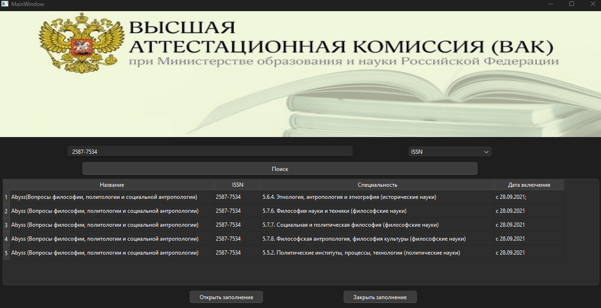

# ResearchCatalog-VAK

Эта программа разработана для хранения и поиска информации о научных изданиях, входящих в перечень рецензируемых изданий Высшей аттестационной комиссии (ВАК).

## Описание

**ResearchCatalog-VAK** предоставляет пользователям инструмент для автоматизированного управления данными научных изданий. Программа позволяет структурировать, фильтровать и быстро находить информацию о журналах по различным параметрам, таким как название, ISSN, направление и дата включения.

Основная цель — упростить процесс анализа публикационной активности и помочь исследователям выбрать подходящие журналы для публикации научных статей.

## Требования

Для работы программы необходимы:
- **C++**: компилятор с поддержкой стандарта C++17
- **Qt**: версия 5.15 или выше
- **SQLite**: встроенный модуль базы данных

## Установка

1. Клонируйте репозиторий:

   ```bash
   git clone https://github.com/Vladislav-fesc/ResearchCatalog-VAK
   ```

2. Откройте проект в **Qt Creator** или настройте сборку через консоль:

   ```bash
   qmake && make
   ```

3. Убедитесь, что все зависимости собраны корректно, и запустите скомпилированный файл.

## Использование

1. Запустите программу.
2. Если база данных пуста, загрузите информацию из файла `.txt`:
   - Подготовьте файл с данными в формате:
     ```text
     Название|ISSN|Направление|Дата включения
     ```
   - Выберите файл для загрузки через кнопку "Загрузить данные".
3. Выполните поиск:
   - Введите критерий (например, название или ISSN).
   - Выберите столбец для поиска (например, "Название", "ISSN", "Направление" или "Дата включения").
   - Нажмите кнопку "Поиск". Результаты отобразятся в таблице. Пример результатов показан на изображении ниже:

   

4. Очистите базу данных, если необходимо, через кнопку "Очистить базу".

## Пример работы

### Формат файла данных
Пример файла для загрузки:
```text
Academia. Архитектура и строительство|1234-5678|Строительство|2024-01-01
Alma mater (Вестник высшей школы)|8765-4321|Образование|2024-02-15
```

### Поиск по данным
Введите название журнала и выберите критерий поиска название журнала, например:  
**"Academia. Архитектура и строительство"**  
Программа отобразит все записи, соответствующие запросу.


## Преимущества
- Автоматизация работы с данными научных изданий.
- Удобный и интуитивно понятный интерфейс.
- Возможность обновления данных из новых файлов.\
